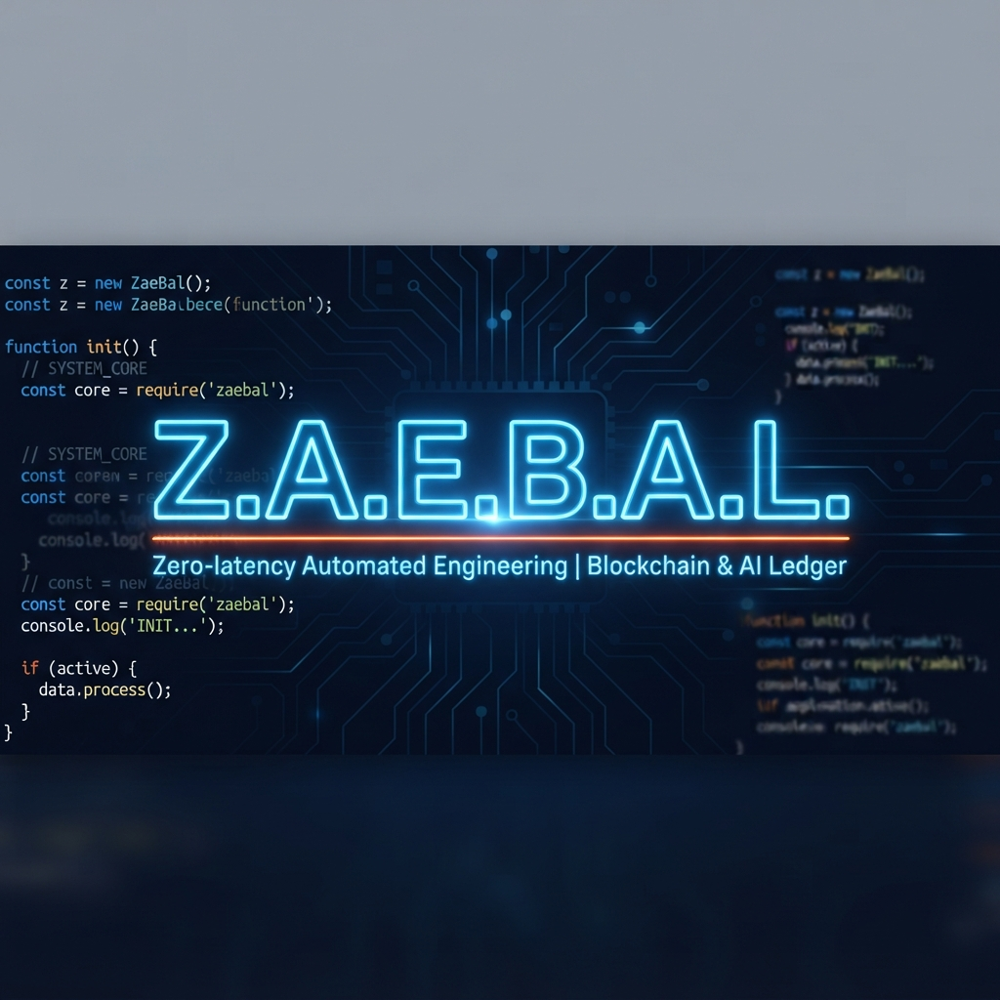

<div align="center">



<h3>
<strong>Z</strong>aebal? · <strong>A</strong>udit · <strong>E</strong>rrors ·
<strong>B</strong>reak · <strong>A</strong>nalyze · <strong>L</strong>eave no assumption
</h3>

<p>
<strong>Read this in other languages</strong><br>
<a href="README.md">🇺🇸 English</a> ·
<a href="README.ru.md">🇷🇺 Русский</a>
</p>

<p>


</p>

<p>
<strong>Profanity-triggered self-audit for coding agents.</strong><br>
Z.A.E.B.A.L. treats user frustration as an operational signal: stop, re-check the
agent's assumptions, and escalate repeated failures to an independent auditor.
</p>

<p>
<a href="#why-it-exists">Why</a> ·
<a href="#capability-map">Capabilities</a> ·
<a href="#how-it-works">How it works</a> ·
<a href="#install">Install</a> ·
<a href="#configuration">Configuration</a> ·
<a href="#architecture">Architecture</a>
</p>

</div>

---

## Why it exists

When a coding agent gets stuck, it often repeats the same action with small variations
because one underlying belief about the task or codebase is wrong. The agent still treats
that belief as a fact, so another self-check can reproduce the same mistake.

Z.A.E.B.A.L. adds a feedback loop to the user-message boundary:

- profanity and direct complaints become an audit signal;
- positive profanity such as "заебись, работает" does not add to the streak and closes
  an active incident as an acknowledgment;
- repeated signals escalate from a local protocol to a full stop;
- at level 3, an external agent reads the transcript and repository evidence;
- work resumes only after an explicit user acknowledgment.

There is intentionally **no technical tool lock**. The protocol changes the agent's
instructions and asks it to stop; the human always retains the final control.

## Capability map

| Capability | What it does | Implementation |
|---|---|---|
| Multilingual detection | Detects Russian and English profanity, including punctuation-separated and common leetspeak forms. | `core/wordlists/{ru,en}.txt` + NFKC normalization |
| Intent classification | Separates praise, directed complaints, and ambiguous frustration before changing the streak. | `classify()`; weights `0`, `1.0`, and `0.5` |
| Session escalation | Tracks each session in a 30-minute sliding window and selects L1, L2, or L3. | Atomic JSON state |
| Three audit protocols | Injects increasingly strict instructions: independent checks, assumption inventory, and full stop. | `core/protocol/L1.md` → `L3.md` |
| External auditor | Runs an independent agent against the transcript tail and repository evidence. | `delegate_task` (Hermes) |
| Hermes adapter | Hooks into Hermes Agent at user-message submission. | `adapters/hermes/hook.py` |
| Explicit recovery | Resets the incident only after acknowledgment such as `continue`, `продолжай`, or `по плану`. | Per-session state lifecycle |
| Fail-open safety | A malformed payload, missing auditor, timeout, or internal error never breaks the host session. | Silent exit `0` |

## How it works

```text
User message
    │
    ▼
Hermes hook
on_user_message
    │
    ▼
core/zaebal.py
normalize → detect → classify
    │
    ├─ clean / praise ───────────────────────────────► silence
    │
    └─ directed (+1.0) / ambiguous (+0.5)
                         │
                         ▼
                per-session streak
                         │
              ┌──────────┼──────────┐
              ▼          ▼          ▼
             L1         L2         L3
              │          │          ├─ external auditor
              └──────────┴──────────┴─ protocol injected into context
```

### Escalation levels

| Level | Streak weight | Agent behavior | External auditor |
|---|---:|---|---|
| **L1** | `1–1.5` | Stop, run two independent checks, inventory assumptions, prepare a micro-plan. | Optional |
| **L2** | `2–3.5` | Remove unverified assumptions and compare the work against the original request. | Disabled by default |
| **L3** | `4+` | Stop all agents and background work; show the user the belief, evidence, and mismatch. | Enabled by default |

Directed complaints add `1.0`; profanity without a detected addressee adds `0.5`.
The window is 30 minutes. Calm questions do not reset it. Genuine praise or an explicit
acknowledgment does.

## Install

Requirements:

- `python3`; the core uses only the standard library;
- [Hermes Agent](https://hermes-agent.nousresearch.com) with shell hooks support.

```bash
# Clone the repo
git clone https://github.com/region39/Z.a.e.b.a.l ~/.zaebal

# Install the Hermes hook
mkdir -p ~/.hermes/hooks
ln -s ~/.zaebal/adapters/hermes/hook.py ~/.hermes/hooks/zaebal.py
```

Add to `~/.hermes/config.yaml`:

```yaml
hooks:
  on_user_message:
    - command: python3 ~/.hermes/hooks/zaebal.py
      stdin: true
      env:
        ZAEBAL_STATE_DIR: ~/.zaebal
```

Restart Hermes after installation.

## Verify

Run the core directly without touching your normal state:

```bash
printf '{"session_id":"demo","prompt":"ты меня заебал"}' \
  | ZAEBAL_STATE_DIR="$(mktemp -d)" python3 core/zaebal.py
```

The output should contain `<zaebal level="1">`.

Positive profanity should remain silent:

```bash
printf '{"session_id":"demo-praise","prompt":"заебись, работает!"}' \
  | ZAEBAL_STATE_DIR="$(mktemp -d)" python3 core/zaebal.py
```

## Configuration

Defaults live in [`core/config.json`](core/config.json). User overrides live in
`~/.zaebal/config.json` and are loaded on the next trigger:

```json
{
  "auditor": "same",
  "audit_levels": [3],
  "auditor_timeout_sec": 90,
  "auditor_command": "",
  "transcript_tail_chars": 12000
}
```

| Key | Default | Meaning |
|---|---|---|
| `auditor` | `"same"` | Same vendor as the host, or `"none"`. |
| `audit_levels` | `[3]` | Levels that synchronously invoke an external auditor. Use `[2, 3]` for earlier audits. |
| `auditor_timeout_sec` | `90` | Maximum time to wait for the auditor response. |
| `auditor_command` | `""` | Custom command; the audit prompt is appended as the final argument. |
| `transcript_tail_chars` | `12000` | Maximum transcript tail sent to the auditor. |

## Architecture

```text
zaebal/
├── core/
│   ├── zaebal.py          # detection, state, escalation, transcript and auditor
│   ├── config.json        # default runtime configuration
│   ├── protocol/          # L1.md, L2.md, L3.md
│   └── wordlists/         # ru.txt, en.txt
├── adapters/
│   └── hermes/            # Hermes Agent shell hook
├── skills/
│   └── zaebal/SKILL.md    # full protocol for the agent
├── tests/
├── .gitignore
├── README.md
└── README.ru.md
```

## Named error patterns

Recognize these patterns in your own behavior — they are collected from real agent-session postmortems:

- **Sycophancy.** The agent agrees with criticism out of politeness and abandons a working solution under pressure.
- **Hallucinated correctness.** The opposite extreme: the agent defends its code to the end, inventing facts — imaginary passing tests, nonexistent library features, fabricated documentation.
- **Grounding in reality (execution over intuition).** The cure for both extremes: defending code with verbal arguments is forbidden — only a micro-test, a run, logs.
- **First plausible hypothesis.** A lone agent fixates on the first plausible version of the bug's cause. That is why there are two auditors and they get raw artifacts, not your hypothesis.
- **FACT/HYPOTHESIS calibration.** During the belief inventory, tag every statement: FACT — only if confirmed by execution (a run, a file, a log), otherwise HYPOTHESIS.
- **Written ≠ took effect.** The agent created a config, a hook, an instruction file, or an env variable and assumes it works because "the file is there". But the system may consume it from a different path. Verify not the act of writing but the act of consumption.

## License

MIT
