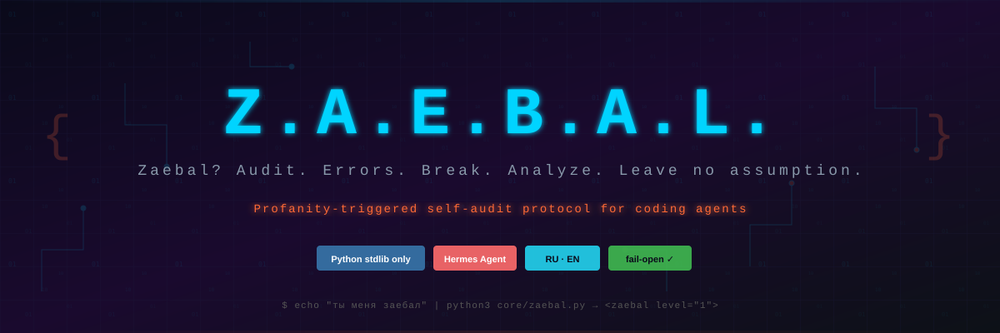

<div align="center">



<h3>
<strong>Z</strong>aebal? · <strong>A</strong>udit · <strong>E</strong>rrors ·
<strong>B</strong>reak · <strong>A</strong>nalyze · <strong>L</strong>eave no assumption
</h3>

<p>
<strong>Читать на других языках</strong><br>
<a href="README.md">🇺🇸 English</a> ·
<a href="README.ru.md">🇷🇺 Русский</a>
</p>

<p>


</p>

<p>
<strong>Самоаудит кодинг-агентов, который запускается по сигналу ругани пользователя.</strong><br>
Z.A.E.B.A.L. воспринимает раздражение пользователя как операционный сигнал: остановиться,
перепроверить убеждения агента и при повторных ошибках передать сессию независимому
аудитору.
</p>

<p>
<a href="#зачем-это-нужно">Зачем</a> ·
<a href="#карта-возможностей">Возможности</a> ·
<a href="#как-это-работает">Как это работает</a> ·
<a href="#установка">Установка</a> ·
<a href="#настройка">Настройка</a> ·
<a href="#архитектура">Архитектура</a>
</p>

</div>

---

## Зачем это нужно

Когда кодинг-агент зацикливается, он часто повторяет одно действие с небольшими
вариациями. Причина обычно не в невнимательности, а в одном неверном убеждении о задаче
или кодовой базе. Агент продолжает считать его фактом, поэтому очередная самопроверка
может воспроизвести ту же ошибку.

Z.A.E.B.A.L. добавляет feedback loop на границе пользовательского сообщения:

- мат и прямые претензии становятся сигналом аудита;
- похвала матом вроде «заебись, работает» не увеличивает стрик и закрывает активный
  инцидент как подтверждение;
- повторные сигналы повышают строгость протокола вплоть до полного стопа;
- на уровне 3 внешний агент читает транскрипт и факты из репозитория;
- работа возобновляется только после явного подтверждения пользователя.

Технической блокировки инструментов намеренно нет. Протокол меняет инструкции агента и
требует остановиться; окончательный контроль остаётся у человека.

## Карта возможностей

| Возможность | Что происходит | Реализация |
|---|---|---|
| Мультиязычный детектор | Распознаёт русский и английский мат, включая разделение знаками и распространённый leetspeak. | `core/wordlists/{ru,en}.txt` + NFKC-нормализация |
| Классификация намерения | До изменения стрика отделяет похвалу, адресную претензию и неоднозначную ругань. | `classify()`; веса `0`, `1.0` и `0.5` |
| Сессионная эскалация | Хранит стрик каждой сессии в скользящем окне 30 минут и выбирает L1, L2 или L3. | Атомарный JSON-state |
| Три протокола аудита | Инжектит всё более строгие инструкции: независимые проверки, инвентаризацию убеждений и полный стоп. | `core/protocol/L1.md` → `L3.md` |
| Внешний аудитор | Запускает независимого агента на хвосте транскрипта и фактах репозитория. | `delegate_task` (Hermes) |
| Адаптер Hermes | Перехватывает отправку сообщения в Hermes Agent. | `adapters/hermes/hook.py` |
| Явное восстановление | Закрывает инцидент только после подтверждения вроде `продолжай`, `согласен` или `по плану`. | Жизненный цикл state каждой сессии |
| Fail-open | Невалидный payload, отсутствие аудитора, timeout или внутренняя ошибка не ломают сессию хоста. | Тихий exit `0` |

## Как это работает

```text
Сообщение пользователя
    │
    ▼
Хук Hermes
on_user_message
    │
    ▼
core/zaebal.py
normalize → detect → classify
    │
    ├─ clean / praise ──────────────────────────────► тишина
    │
    └─ directed (+1.0) / ambiguous (+0.5)
                         │
                         ▼
                  стрик сессии
                         │
              ┌──────────┼──────────┐
              ▼          ▼          ▼
             L1         L2         L3
              │          │          ├─ внешний аудитор
              └──────────┴──────────┴─ протокол в контекст агента
```

### Уровни эскалации

| Уровень | Вес стрика | Поведение агента | Внешний аудитор |
|---|---:|---|---|
| **L1** | `1–1.5` | Остановиться, провести две независимые проверки, инвентаризировать убеждения и подготовить микро-план. | Опционально |
| **L2** | `2–3.5` | Убрать неподтверждённые предположения и сверить работу с исходным запросом. | По умолчанию выключен |
| **L3** | `4+` | Остановить всех агентов и фоновые задачи; показать человеку убеждение, доказательства и расхождение. | По умолчанию включён |

Адресная претензия добавляет `1.0`, ругань без обнаруженного адресата — `0.5`. Окно
стрика составляет 30 минут. Спокойный вопрос его не сбрасывает. Настоящая похвала или
явное подтверждение — сбрасывает.

## Установка

Требования:

- `python3`; ядро использует только стандартную библиотеку;
- [Hermes Agent](https://hermes-agent.nousresearch.com) с поддержкой shell hooks.

```bash
# Клонировать репозиторий
git clone https://github.com/region39/Z.a.e.b.a.l ~/.zaebal

# Установить хук Hermes
mkdir -p ~/.hermes/hooks
ln -s ~/.zaebal/adapters/hermes/hook.py ~/.hermes/hooks/zaebal.py
```

Добавить в `~/.hermes/config.yaml`:

```yaml
hooks:
  on_user_message:
    - command: python3 ~/.hermes/hooks/zaebal.py
      stdin: true
      env:
        ZAEBAL_STATE_DIR: ~/.zaebal
```

Перезапустить Hermes после установки.

## Проверка

Запустите ядро напрямую, не затрагивая обычный state:

```bash
printf '{"session_id":"demo","prompt":"ты меня заебал"}' \
  | ZAEBAL_STATE_DIR="$(mktemp -d)" python3 core/zaebal.py
```

В выводе должен появиться `<zaebal level="1">`.

Похвала матом должна остаться без вывода:

```bash
printf '{"session_id":"demo-praise","prompt":"заебись, работает!"}' \
  | ZAEBAL_STATE_DIR="$(mktemp -d)" python3 core/zaebal.py
```

## Настройка

Дефолты лежат в [`core/config.json`](core/config.json). Пользовательские
переопределения — в `~/.zaebal/config.json`; они подхватываются на следующем триггере:

```json
{
  "auditor": "same",
  "audit_levels": [3],
  "auditor_timeout_sec": 90,
  "auditor_command": "",
  "transcript_tail_chars": 12000
}
```

| Ключ | По умолчанию | Назначение |
|---|---|---|
| `auditor` | `"same"` | Тот же вендор или `"none"`. |
| `audit_levels` | `[3]` | Уровни, на которых синхронно вызывается внешний аудитор. `[2, 3]` включает его раньше. |
| `auditor_timeout_sec` | `90` | Максимальное время ожидания ответа аудитора. |
| `auditor_command` | `""` | Пользовательская команда; audit prompt добавляется последним аргументом. |
| `transcript_tail_chars` | `12000` | Максимальный хвост транскрипта для аудитора. |

## Архитектура

```text
zaebal/
├── core/
│   ├── zaebal.py          # детектор, state, эскалация, транскрипт и аудитор
│   ├── config.json        # дефолтная runtime-конфигурация
│   ├── protocol/          # L1.md, L2.md, L3.md
│   └── wordlists/         # ru.txt, en.txt
├── adapters/
│   └── hermes/            # shell hook для Hermes Agent
├── skills/
│   └── zaebal/SKILL.md    # полный протокол для агента
├── tests/
├── .gitignore
├── README.md
└── README.ru.md
```

## Именованные паттерны ошибок

Узнаваемые паттерны из реальных постмортемов:

- **Подхалимаж (sycophancy).** Агент соглашается с критикой из вежливости и бросает рабочее решение.
- **Галлюцинированная корректность.** Обратный перекос: агент защищает код до конца, выдумывая проходящие тесты, несуществующие фичи, вымышленную документацию.
- **Заземление в реальность (запуск, а не слова).** Лекарство от обоих крайностей: защита кода только через микро-тест, запуск, логи. Словами — нельзя.
- **Первая правдоподобная гипотеза.** Один агент фиксируется на первой версии причины бага. Поэтому аудиторов — два, и они получают сырые артефакты.
- **FACT/HYPOTHESIS калибровка.** Тегировать каждое утверждение: FACT — только если подтверждено выполнением, иначе HYPOTHESIS.
- **Written ≠ took effect.** Конфиг написан, но система читает из другого пути. Проверять не факт записи, а факт потребления.

## Лицензия

MIT
